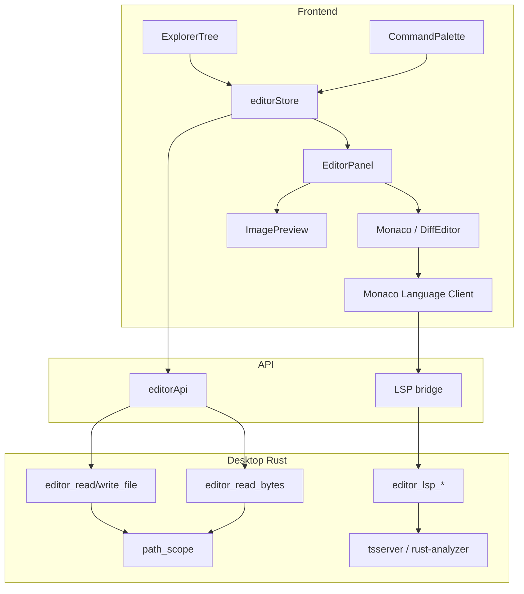

# Monaco Editor Design

## Goal

Replace the Editor main-card stub with a Monaco-based multi-file editor: open project files from the explorer, edit with VS Code–like affordances, save (manual + auto-save), and grow into persist, previews, diff/split/palette, and LSP — without breaking the Rust-first desktop boundary.

## Context

- Shell already has an always-mounted `editor` main card ([`shellMainPanel.tsx`](../../src/modules/shell/ui/panels/shellMainPanel.tsx)).
- Explorer file clicks set `openFilePath` and switch to the editor card; the card only shows the path string.
- ADR [`0001-rust-first-desktop-boundary`](../../src-tauri/docs/adr/0001-rust-first-desktop-boundary.md) already names future `editor_read_file`.
- No Monaco (or other editor) dependency exists yet.

## Decisions

| Topic | Choice |
| --- | --- |
| Engine | Monaco via `@monaco-editor/react` (Phase 4 adds Monaco Language Client) |
| I/O | Rust Tauri commands only; React calls typed `editorApi` |
| Dirty close | Confirm Discard / Cancel; save via ⌘/Ctrl+S or auto-save |
| Auto-save | Debounced ~1s after last edit; **on by default** |
| Tab persistence | Persist tab paths + active path + split layout; reload content from disk (do not restore unsaved buffers) |
| Preview | Images inline; other binaries non-editable notice (no hex viewer) |
| Diff | Monaco `DiffEditor`: working buffer vs last-saved snapshot |
| Split | Two panes, horizontal or vertical; shared tab set, per-pane active path |
| Command palette | ⌘/Ctrl+Shift+P; app-owned commands + open tabs (no extension host) |
| LSP (first) | TypeScript/JavaScript language server + `rust-analyzer`, spawned from Rust |

## Architecture

| Layer | Responsibility |
| --- | --- |
| Desktop | Path-scoped read/write (UTF-8 text), bytes read for images (Phase 2), LSP process I/O (Phase 4) |
| `editorApi` | Typed `invoke` / event wrappers (mirror explorer pattern) |
| `editorStore` | Tabs, active paths, dirty flags, content/errors, split/diff UI flags, persist partial |
| UI | Tab bar, Monaco host(s), image/binary panes, palette overlay |

## Phased delivery

Ship in order. Each phase leaves the app usable.

### Phase 1 — Core editing + auto-save

**Desktop**

- Module `src-tauri/src/editor/`
- `editor_read_file { projectRoot, path } → { content: string }`
- `editor_write_file { projectRoot, path, content }`
- Reuse explorer `path_scope`; reject outside project, non-UTF-8, and files over ~2 MiB for text edit
- Register commands in `lib.rs`; allow in capabilities

**Frontend**

- Expand `src/modules/editor/`: `api/editorApi.ts`, store, `ui/EditorPanel.tsx`
- Store shape (minimum): `tabs: { path }[]`, `activePath`, `dirtyByPath`, content/loading/error maps; `openTab` / `closeTab` / `setActivePath` / `markDirty` / `saveActive`
- Wire `EditorPanel` into shell main panel; explorer `openFile` → `openTab` + set main card `editor`
- One Monaco instance; models keyed by path; language from extension; minimap + find left on
- Auto-save: debounce ~1s when dirty → write → clear dirty; surface write errors inline

### Phase 2 — Persist tabs + image / binary preview

**Persist**

- Zustand `persist` for tab paths, active path, split state (same session storage stack as shell/project)
- Rehydrate in `sessionRoot`; reset in `sessionReset`
- On restore: read files for restored paths; skip missing files quietly

**Preview**

- Classify by extension: text → Monaco; image (`png` `jpg` `jpeg` `gif` `webp` `svg` `ico` `bmp`) → preview; else → binary notice
- `editor_read_bytes` (or base64 payload) for images under project root
- Non-text tabs: no dirty / no auto-save

### Phase 3 — Diff, split panes, command palette

- Keep last-saved snapshot per text tab; “Compare with saved” → `DiffEditor`; exit returns to normal editor
- Split: `null | { orientation: 'horizontal' | 'vertical'; secondaryPath: string | null }`; commands Split right / down / Unsplit
- Palette: fuzzy filter over fixed commands + open tab paths

### Phase 4 — LSP beyond Monaco builtins

- Rust LSP manager: start/stop/send; event `editor://lsp-message`
- Resolve `typescript-language-server` (or equivalent) and `rust-analyzer` from PATH; clear error if missing
- Workspace folder = active project root
- Frontend Monaco Language Client over Tauri bridge (not ad hoc localhost from UI)
- Builtins remain fallback when LSP unavailable

**Out of scope even after Phase 4:** VS Code extension host, arbitrary third-party extensions, debugger UI, hex editor.

## Error handling

- Path outside project → command error; UI shows message, does not open tab content
- Missing file on open/restore → skip or show error on that tab
- Non-UTF-8 / oversized text → refuse edit with clear message
- Save / auto-save failure → keep dirty; show inline error
- Missing LSP binary → editor still works; no completions beyond Monaco builtins

## Testing

- Vitest: store open/switch/close/dirty; auto-save debounce (fake timers); explorer opens tab; persist rehydrate; preview routing; palette; split focus
- Rust unit tests: path scope, UTF-8/size rejection, bytes read fixtures
- Manual Tauri smoke per phase

## Domain notes

Add `src/modules/editor/CONTEXT.md` when implementing Phase 1 (lazy domain docs per CONTEXT-MAP). Terms: Editor Panel, Editor Tab, Open File (path), Dirty — align with shell “main card” vocabulary (avoid calling the editor card a “tab” in domain docs; file tabs are UI chrome inside the editor card).
